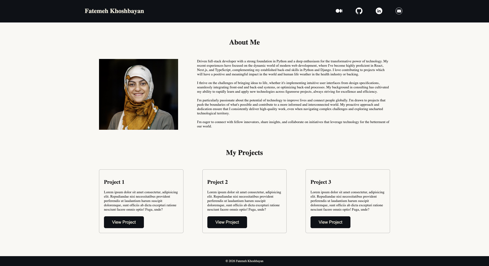
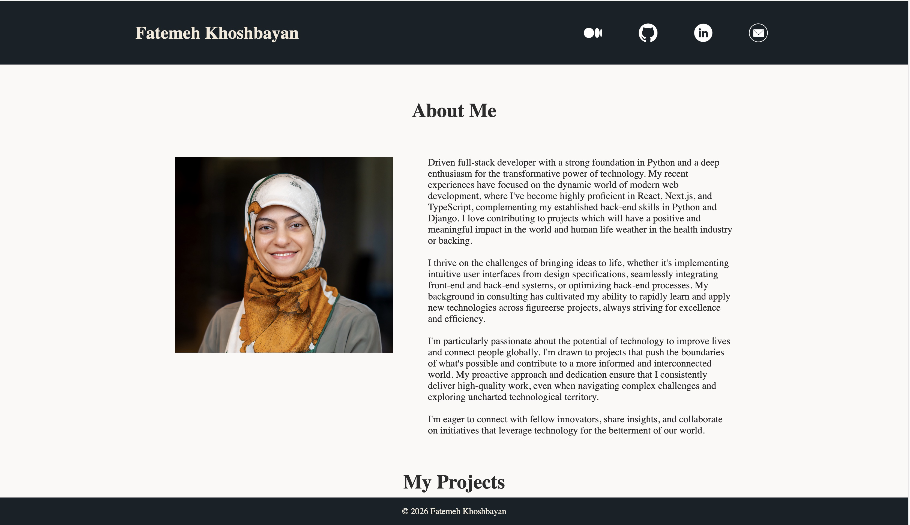
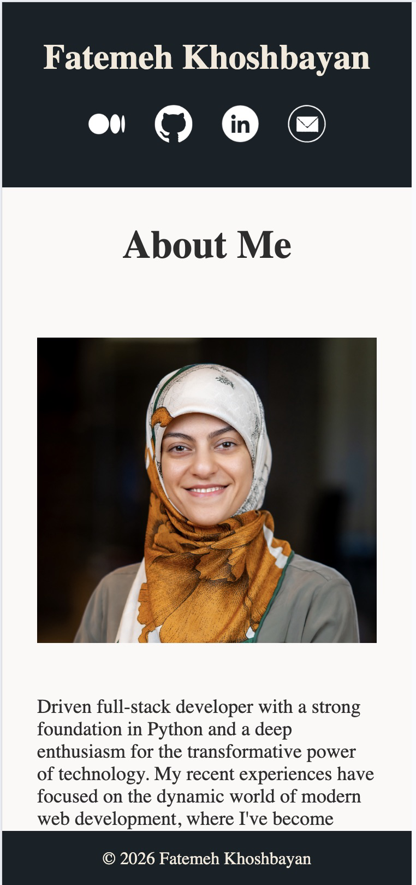

# Responsive Web Components

A responsive personal portfolio webpage built with semantic HTML and modern CSS. It includes an About section, a projects grid, contact me form, and social links to Medium, GitHub, LinkedIn, and email.

## Live Demo

[https://fatemehkhoshbayan.github.io/responsive-web-components/](https://fatemehkhoshbayan.github.io/responsive-web-components/)

## Features

- Semantic page structure using `header`, `nav`, `main`, `section`, `article`, and `footer`
- Responsive design with breakpoints for tablet, laptop, and wide-monitor layouts
- Sticky header and footer with a flexible main content area
- About section with profile image and biography content
- Projects section with card-style layout and category badges
- Accessible social icons with descriptive `alt` text
- Contact Me form with different subject options

## Tech Stack

| Area | Choice |
| --- | --- |
| Markup | HTML5 |
| Styling | CSS3 |
| JavaScript | None |

## Project Structure

| Path | Purpose |
| --- | --- |
| `index.html` | Main portfolio page markup |
| `styles.css` | Global styles, layout, and responsive breakpoints |
| `media/` | Local image assets (social icons and profile image) |

## Getting Started

1. Clone this repository:
   - `git clone https://github.com/fatemehkhoshbayan/responsive-web-components.git`
2. Move into the project folder:
   - `cd responsive-web-components`
3. Open `index.html` in your browser.

You can also run a simple local static server if you prefer.

## Notes

- Some project card images in `index.html` currently use placeholder screenshot URLs.
- The footer copyright is set to `2026`.

## Screenshots

## License

All rights reserved unless otherwise noted.
